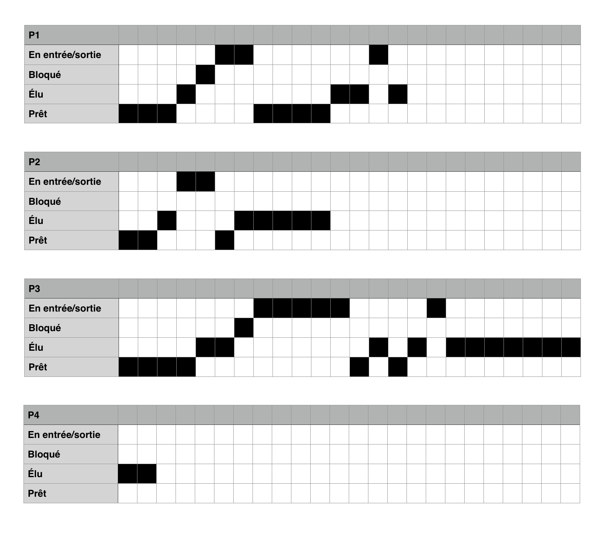
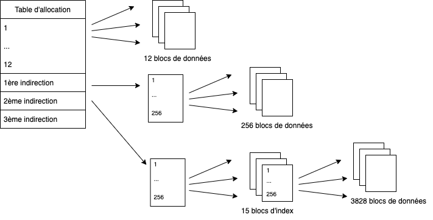
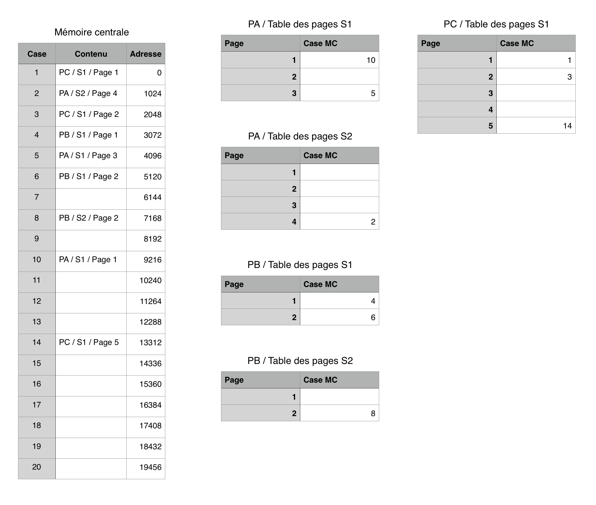

# Exercice 1

##### 1

En sytème d'exploitation, une famine survient dans le cas où un processus se trouve dépossédé pendant trop longtemps de l'accès à une ressource pour laquelle l'accès est géré par exclusion mutuelle. Cela peut survenir par exemple lorsque dans un système de lecteurs/rédacteurs où les rédacteurs sont en attente tant qu'il existe des lecteurs, les lecteurs trop nombreux se coalisent contre les rédacteurs qui se trouvent alors en famine.

##### 2

Il y a ici effectivement interblocage:

- A est en attente: il ne peut pas prendre R2 car possédé par B.
- B est en attente: il ne peut pas prendre R4 car possédé par C.
- C est en attente: il ne peut pas prendre R1 car possédé par A.

##### 3

Le chemin absolu de examens.doc est `/Users/Marc/cours/examens.doc`.\
Depuis le répertoire Laura, `jeu.exe` se trouve dans `../../bin/Mesexe/jeu.exe`.

# Exercice 2

## Question 1

### Processus ordonnés selon un algorithme FIFO

Les processus sont ici traités par ordre d'apparition: _First In, First Out_ et executés les uns à la suite des autres.\
L'ordre de service sera donc: P1, P2, P3, P4.\
Temps de réponse: P1: 4, P2: 10, P3: 22, P4: 24.

### Processus ordonnés selon un algorithme par priorités

Ici, les processus les plus importants seront traités en premier.\
L'ordre de service sera: P4, P2, P1, P3.\
Temps de réponse: P1: 12, P2: 8, P3: 24, P4: 2.

### Processus ordonnés par tourniquet

Nous avons ici une répartion égalitaire du processeur par alternance des processus selon un quantum de temps donné.\
L'ordre de service sera: P1, P2, P3, P4, P1, P2, P3, P2, P3.\
Temps de réponse: P1: 10, P2: 16, P3: 24, P4: 8.

## Question 2

\

# Exercice 3

## Question 1

2Mo = 2097152 octets.\
2097152 / 512 = 4096 octets

Ce fichier occupe donc **4096** blocs de données.

On imagine que l'on utilise le système de fichiers _ext_, avec des inodes comportant une table d'allocation de 15 entrées, dont les 12 premières avec des pointeurs directs vers des blocs de données puis 3 entrées pointants vers des blocs d'index avec une simple, double et triple indirection.\

Le schéma suivant décrit l'allocation des blocs de fichiers:
\
\
\

Explication:  Nous avons 12 blocs de données en accès direct et 256 en première indirection.\
Il reste 4096 - 256 - 12 = 3828 blocs à allouer.

Le deuxième niveau d'indirection est amplement suffisant pour allouer les blocs restants puisque nous pouvons référencer 256^2^ soit 65536 blocs de données.

3828 / 256 = 14.953125. Il nous faudra utiliser 15 blocs d'index pour référencer les blocs restants.


Nombre d'accès disque: il existe dans les systèmes linux un cache mémoire pour les blocs disques, nous n'avons donc pas besoin de retrouver les blocs d'adresses depuis la table d'adresses présente dans l'inode à chaque requête sur le fichier et suivre les indirections. Un accès est suffisant puisqu'ils se trouveront ensuite dans le cache mémoire avec une politique de remplacement _LRU_.\
Pour les 300 premiers blocs, nous avons 12 blocs en accès direct, 256 bloc avec une indirection simple (donc un bloc d'adresses) et 32 blocs avec une indirection double (2 blocs d'adresses).\
12 + (1 + 256) + (2 + 32) = il faudra **303** accès disque.

## Question 2

##### 1.

4 Mo = 4194304 octets. 4194304 / 512 = **8192**.

##### 2.

512 / 4 = **128**.

##### 3.

Le bloc d'adresses en première indirection peut pointer vers **128** blocs de données.

##### 4.

128^2^=**16384** (128 blocs d'index pointant vers des blocs d'index pointant à leur tour vers 128 blocs de données).

##### 5.

8192 blocs de données. 12 en accès direct, 128 avec une indirection simple (1 bloc d'adresse).\
Il reste 8052 blocs allouables en indirection double. 8052 / 128 = 62.90625. Il nous faut 63 blocs d'adresses supplémentaires, soit **64** au total.


# Exercice 4

Les deux impressions peuvent survenir dans le même temps: on ne connaît pas la durée des tâches d'impression et les deux processus peuvent se téléscoper. Aussi il faut considérer que l'imprimante est une ressource critique et mettre en place une exclusion mutuelle pour restreindre son accès, de manière à ce qu'un seul processus puisse l'utiliser à la fois. Les sections critiques des deux programmes sont celles qui ont trait à l'action d'imprimer un fichier dans son intégralité.

On a besoin d'utiliser les primitives `Init`, `P` et `V` pour initialiser une mutex, se mettre en attente de l'accès à la ressource et enfin pour restituer cet accès.

```
Processus P1

debut
Init(AccesImprimante, 1)
Boucle
    attendre(5 unités de temps);
    Ouvrir(F1);
    P(AccesImprimante)
    tant que la fin du fichier F1 n'est pas atteinte
    faire
        lire(F1, ligne);
        Imprimer (ligne);
    fait
    V(AccesImprimante)
    fermer(F1);
fin boucle
fin
```

```
Processus P2

debut
Init(AccesImprimante, 1)
Boucle
    attendre(10 uniteés de temps);
    Ouvrir(F2);
    P(AccesImprimante)
    tant que la fin du fichier F2 n'est pas atteinte
    faire
        lire(F2, ligne);
        Imprimer (ligne);
    fait
    V(AccesImprimante)
    fermer(F2);
fin boucle
fin
```

# Exercice 5

## Question 1

\

## Question 2

##### a.

Les pages font 1024 octets.\
2272 / 1024 = 2.21875, il s'agit donc de la page 3 (dans S1).\
2272 % 1024 = 224, on aura donc un déplacement de 224.\
L'adresse virtuelle est donc **(S1, P3, 224)**.

Cela correspond à la case 5 de la mémoire centrale, d'adresse 4096, auquelle on ajoute pour obtenir l'adresse physique le déplacement de 224, soit **4320**.

##### b.

3175 / 1024 = 3.10058594, il s'agit donc de la page 4 (soit la page 2 de S2).\
3175 % 1024 = 103, on aura donc un déplacement de 103.\
L'adresse virtuelle est donc **(S2, P2, 103)**.

Cela correspond à la case 8 de la mémoire centrale, d'adresse 7168, auquelle on ajoute pour obtenir l'adresse physique le déplacement de 103, soit **7271**.

##### c.

6248 / 1024 = 6.1015625, il s'agit ici de la page 7, qui n'existe pas dans l'espace d'adressage du processus C. Nous aurons donc la levée d'une trappe de type `SIGSEGV` (une _segmentation fault_).
